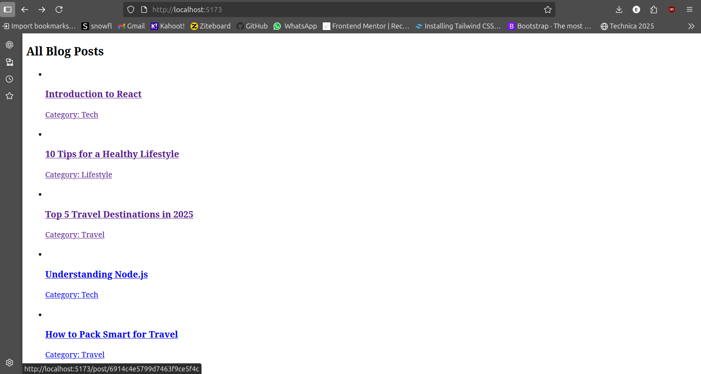

# MERN Blog Application

## **Project Overview**

This is a full-stack **MERN (MongoDB, Express.js, React.js, Node.js) Blog Application**.
The application allows users to:

* View all blog posts
* View a single blog post in detail
* Create new blog posts
* Manage categories
* Navigate between pages with React Router

The backend uses **Express.js** and **MongoDB** for data storage.
The frontend uses **React.js** with **Vite** as the build tool.

 **Folder Structure**
blog-project/
├─ client/          # React frontend (Vite)
│  ├─ src/
│  │  ├─ components/
│  │  │  ├─ PostList.jsx
│  │  │  ├─ PostDetail.jsx
│  │  │  └─ PostForm.jsx
│  │  ├─ pages/
│  │  ├─ App.jsx
│  │  └─ main.jsx
│  ├─ .env.example
│  └─ package.json
├─ server/          # Express backend
│  ├─ models/
│  │  ├─ Post.js
│  │  └─ Category.js
│  ├─ routes/
│  │  ├─ postRoutes.js
│  │  └─ categoryRoutes.js
│  ├─ server.js
│  ├─ .env.example
│  └─ package.json

**Setup Instructions**

### Backend

1. Navigate to the server folder:

```bash
cd server
```

2. Install dependencies:

```bash
npm install
```

3. Create `.env` file (or copy `.env.example`) and set:

```
MONGO_URL=your_mongodb_connection_string
PORT=5000
```

4. Start the server:

```bash
npm run dev
```

Server will run on `http://localhost:5000`.

---

### Frontend

1. Navigate to the client folder:

```bash
cd client
```

2. Install dependencies:

```bash
npm install
```

3. Create `.env` file (or copy `.env.example`) and set:

```
VITE_API_URL=http://localhost:5000/api
```

4. Start the frontend:

```bash
npm run dev

Frontend will run on `http://localhost:5173`.

## **API Documentation**

### Posts

| Endpoint         | Method | Description       |
| ---------------- | ------ | ----------------- |
| `/api/posts`     | GET    | Get all posts     |
| `/api/posts/:id` | GET    | Get a single post |
| `/api/posts`     | POST   | Create a new post |
| `/api/posts/:id` | PUT    | Update a post     |
| `/api/posts/:id` | DELETE | Delete a post     |

### Categories

| Endpoint          | Method | Description           |
| ----------------- | ------ | --------------------- |
| `/api/categories` | GET    | Get all categories    |
| `/api/categories` | POST   | Create a new category |


## **Features Implemented**

* CRUD operations for blog posts
* Category management
* React Router navigation (`/`, `/post/:id`, `/create`)
* API integration with fetch
* Responsive UI using React components
* Environment variable configuration for API URLs
* Error handling for API requests

---

## **Screenshots**

### Home Page (Post List)



### Post Detail Page


